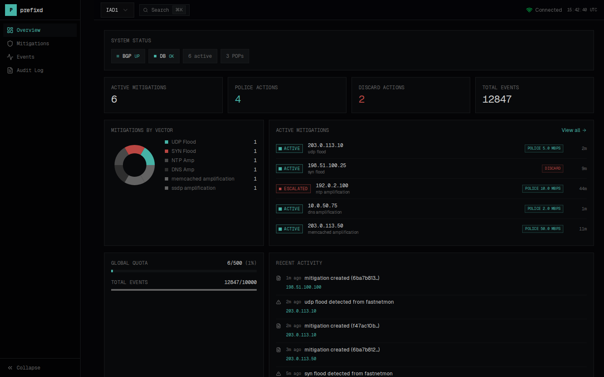

# prefixd

[](https://github.com/lance0/prefixd/actions/workflows/ci.yml)
[](https://www.rust-lang.org)
[](LICENSE)

**prefixd** is a BGP FlowSpec policy daemon for automated DDoS mitigation. It receives attack signals from detectors, applies policy-driven playbooks, and announces FlowSpec rules to routers via GoBGP.



---

## Why prefixd?

You have detectors (FastNetMon, Kentik, Prometheus alerts) that know when you're under attack. You have routers (Juniper, Arista, Cisco) that can filter traffic at line rate with FlowSpec. But there's a gap:

| Problem | Without prefixd | With prefixd |
|---------|-----------------|--------------|
| **Detector → Router** | Manual CLI or fragile scripts | Automated policy engine |
| **Response time** | Minutes (operator intervention) | Seconds (API-driven) |
| **Safety** | Easy to fat-finger, no guardrails | Quotas, safelist, /32-only, TTLs |
| **Visibility** | Scattered logs, no audit trail | Dashboard, metrics, audit log |
| **Expiry** | Forget to remove rules | Auto-expire via TTL |

**Key idea:** Detectors signal intent, prefixd decides policy. No detector ever speaks BGP directly.

```
Detector ──► prefixd ──► GoBGP ──► Routers
                │
                ├── Policy Engine (playbooks)
                ├── Guardrails (quotas, safelist)
                └── Reconciliation (auto-expire)
```

---

## Quick Start

### 1. Clone and configure

```bash
git clone https://github.com/lance0/prefixd.git
cd prefixd

# Copy example environment file
cp .env.example .env

# Edit .env to set your passwords (optional for local testing)
# POSTGRES_PASSWORD=your-secure-password
```

### 2. Start the stack

```bash
docker compose up -d
```

This starts 7 services:

| Service | Purpose | Ports |
|---------|---------|-------|
| **nginx** | Reverse proxy (single entrypoint) | 80 |
| **prefixd** | Policy daemon | internal |
| **dashboard** | Web UI | internal |
| **gobgp** | BGP route server | 179 (BGP) |
| **postgres** | State storage | 5432 |
| **prometheus** | Metrics storage | 9091 |
| **grafana** | Monitoring dashboards | 3001 |

### 3. Verify it's running

```bash
# Check all services are healthy
docker compose ps

# Test the API
curl http://localhost/v1/health
# {"status":"ok","version":"0.8.3","auth_mode":"none"}
```

### 4. Create an admin account

```bash
docker compose exec prefixd prefixdctl operators create \
  --username admin --role admin
# Enter password when prompted
```

### 5. Open the dashboard

```bash
open http://localhost
```

Login with the admin credentials you just created.

### Troubleshooting

```bash
# View prefixd logs
docker compose logs prefixd

# View GoBGP logs
docker compose logs gobgp

# Restart everything
docker compose restart
```

**Common issues:**
- Port 80 in use → Stop local web server or change nginx port in docker-compose.yml
- Port 5432 in use → Stop local PostgreSQL or change port in docker-compose.yml
- Port 179 in use → Another BGP daemon is running
- "connection refused" → Wait a few seconds for services to start

---

## Next Steps

Once you have prefixd running locally:

### 1. Configure your inventory

Edit `configs/inventory.yaml` to map your IP space to customers:

```yaml
customers:
  - customer_id: acme
    name: "ACME Corp"
    prefixes:
      - "203.0.113.0/24"
    services:
      - service_id: dns
        assets:
          - ip: "203.0.113.10"
        allowed_ports:
          udp: [53]
```

### 2. Define playbooks

Edit `configs/playbooks.yaml` to set response policies:

```yaml
playbooks:
  - name: udp_flood
    match:
      vector: udp_flood
    steps:
      - action: police
        rate_bps: 10000000    # 10 Mbps
        ttl_seconds: 120
      - action: discard       # Escalate if attack persists
        ttl_seconds: 300
```

### 3. Connect a detector

Point your detector at prefixd's API:

```bash
curl -X POST http://localhost/v1/events \
  -H "Content-Type: application/json" \
  -H "Authorization: Bearer $PREFIXD_API_TOKEN" \
  -d '{
    "timestamp": "'"$(date -u +%Y-%m-%dT%H:%M:%SZ)"'",
    "source": "fastnetmon",
    "victim_ip": "203.0.113.10",
    "vector": "udp_flood",
    "bps": 5000000000
  }'
```

See [FastNetMon Integration](docs/detectors/fastnetmon.md) for a complete setup guide.

### 4. Peer with your routers

Configure GoBGP neighbors in `configs/gobgp.conf` and set up FlowSpec import policies on your routers. See [Router Setup](docs/deployment.md#router-configuration).

---

## Features

| Category | What it does |
|----------|--------------|
| **Signal Ingestion** | HTTP API accepts attack events from any detector |
| **Policy Engine** | YAML playbooks define per-vector responses with escalation |
| **Guardrails** | Quotas, safelist, /32-only enforcement, mandatory TTLs |
| **BGP FlowSpec** | Announces via GoBGP (traffic-rate, discard actions) |
| **Reconciliation** | Auto-expires mitigations, repairs RIB drift every 30s |
| **Dashboard** | Real-time web UI with WebSocket updates and toast notifications |
| **Manual Mitigation** | "Mitigate Now" form for operator-initiated events |
| **Authentication** | Three roles (admin, operator, viewer) with session + bearer hybrid auth |
| **Observability** | Prometheus metrics, Grafana dashboards, structured logs, audit trail |
| **CLI** | `prefixdctl` for status, mitigations, safelist, config reload |

---

## How It Works

1. **Detector sends event** → `POST /v1/events` with victim IP, vector, confidence
2. **Inventory lookup** → Find customer/service owning the IP
3. **Playbook match** → Determine action (police/discard) based on vector
4. **Guardrails check** → Validate quotas, safelist, prefix length
5. **FlowSpec announce** → Send rule to GoBGP via gRPC
6. **Router enforcement** → Traffic filtered at line rate
7. **Auto-expiry** → Rule withdrawn when TTL expires

**Fail-open design:** If prefixd dies, mitigations auto-expire. No permanent rules, no stuck state.

---

## Documentation

| Topic | Link |
|-------|------|
| Full deployment guide | [docs/deployment.md](docs/deployment.md) |
| Configuration reference | [docs/configuration.md](docs/configuration.md) |
| API reference | [docs/api.md](docs/api.md) |
| CLI reference | [docs/cli.md](docs/cli.md) |
| Router setup | [docs/deployment.md#router-configuration](docs/deployment.md#router-configuration) |
| Grafana dashboards | [docs/grafana.md](docs/grafana.md) |
| Architecture | [docs/architecture.md](docs/architecture.md) |

---

## Supported Routers

FlowSpec (RFC 5575, RFC 8955) is supported by:

| Vendor | Platform | Notes |
|--------|----------|-------|
| Juniper | MX, PTX, SRX | Full FlowSpec support |
| Arista | 7xxx | EOS 4.20+ |
| Cisco | IOS-XR | ASR 9000, NCS |
| Nokia | SR OS | 19.x+ |

---

## Requirements

- **Docker** (recommended) or Rust 1.85+ for building from source
- **PostgreSQL 14+** for state storage
- **GoBGP** is included in Docker Compose

---

## Project Status

Current version: **v0.8.3**

- Core functionality stable and tested
- Real-time dashboard with WebSocket updates, toast notifications, and mitigation detail views
- Full operator workflow: manual mitigation, withdraw, safelist management, config browsing
- API may change before v1.0
- See [ROADMAP.md](ROADMAP.md) for planned features

---

## Community

- **Issues:** [GitHub Issues](https://github.com/lance0/prefixd/issues)
- **Contributing:** [CONTRIBUTING.md](CONTRIBUTING.md)
- **Architecture Decision Records:** [docs/adr/](docs/adr/)
- **Security:** [SECURITY.md](SECURITY.md)

---

## License

MIT - See [LICENSE](LICENSE)
